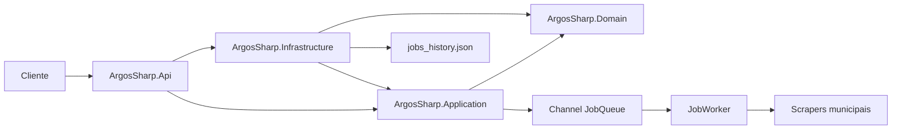
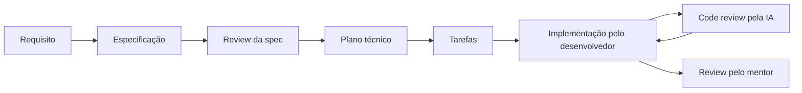

# ArgosSharp

ArgosSharp é uma solução .NET para receber solicitações de busca, criar jobs
assíncronos e coletar notícias em fontes municipais por meio de scrapers
específicos.

> **Estado atual:** o projeto está em uma refatoração não concluída do modelo de
> `Job` e a árvore de trabalho inspecionada em 2026-08-14 não compila. Este README
> descreve o código encontrado; não representa uma versão pronta para execução.

## Estado do projeto

| Área | Estado observado |
|---|---|
| Compilação | 🔴 Bloqueada pela incompatibilidade entre o novo `Domain.Entity.Job` e seus consumidores. |
| Testes | 🟡 Existem três projetos de testes unitários, mas a suíte não inicia enquanto o Domain não compilar. |
| API | 🟡 O código expressa um `POST /Jobs`, porém o composition root possui registros ausentes/incompatíveis. |
| Processamento | 🟡 Fila em memória e dois workers estão implementados no código, mas o fluxo não foi validado em runtime. |
| Scrapers | 🟡 Caraguatatuba, Ubatuba e São Sebastião possuem implementações; somente Caraguatatuba está registrado. |
| Persistência | 🟡 Repository em memória e snapshot JSON existem, com dúvidas abertas sobre lifetime e concorrência. |
| Especificações | 🟡 A separação `Job`/`JobExecution` possui uma spec em rascunho aguardando revisão. |
| ADRs | ⚪ Nenhum ADR retroativo foi criado; existem decisões aguardando confirmação. |
| Documentação-base | 🟢 Constituição, arquitetura, domínio e instruções para agentes estão disponíveis. |

Legenda: 🟢 utilizável/registrado, 🟡 parcial ou não validado, 🔴 bloqueado,
⚪ aguardando decisão ou conteúdo.

## Arquitetura observada



**FACT:** os projetos de produção seguem a direção de dependências mostrada
acima. **INFERENCE:** a estrutura lembra Clean Architecture com ports-and-adapters,
mas esse nome ainda não foi confirmado como decisão arquitetural.

### Projetos

- `ArgosSharp.Api`: host ASP.NET Core, controller, DTOs, validators e composição
  de dependências.
- `ArgosSharp.Application`: casos de uso, orquestração, fila, worker, processor e
  contratos para adapters.
- `ArgosSharp.Domain`: entidades, enums, exceptions, factory e classes atualmente
  organizadas como value objects.
- `ArgosSharp.Infrastructure`: HTTP, parser AngleSharp, mapeamento, scrapers,
  repository e persistência JSON.
- `*.UnitTests`: testes unitários separados por API, Application e Infrastructure.

## Bloqueio atual

O primeiro erro confirmado está em `JobFactory`: ele ainda constrói o formato
anterior de `Job(searchTerm, parameters, status)`, enquanto a nova entidade exige
`Job(name, searchTerm, parameters)`.

Mesmo após alinhar o construtor, outros consumidores ainda esperam propriedades
que deixaram de existir no novo `Job`: `Status`, `Data`, `Error` e `JobHash`.
Agora está confirmado que estado, erro e resultados pertencem a `JobExecution`,
enquanto `Job` permanece uma definição reutilizável. A implementação ainda não
deve prosseguir automaticamente: IDs públicos, aggregate boundaries, lifecycle
completo e migração da persistência continuam abertos no plano.

As perguntas que orientam essa decisão estão em
[`docs/architecture/open-questions.md`](docs/architecture/open-questions.md).

## Ordem recomendada para retomada

1. Revisar a feature spec da separação `Job`/`JobExecution` e responder aos pontos
   ainda abertos.
2. Discutir e aprovar o plano técnico, incluindo possíveis ADRs.
3. O desenvolvedor concluir a implementação manualmente.
4. Solicitar review da implementação e executar a suíte de testes.
5. Investigar composition root, persistência concorrente e pipeline real dos
   scrapers.

Essa ordem evita corrigir a compilação preservando acidentalmente o modelo antigo
ou tomando decisões de identidade/persistência sem o desenvolvedor.

## Validação atual

O comando usado para inspecionar o estado foi:

```powershell
dotnet test ArgosSharp.slnx --no-restore --nologo
```

Resultado em 2026-08-14:

- compilação interrompida por dois erros `CS1503` em `JobFactory`;
- testes não executados;
- warnings de nulabilidade em `ScraperSelectors`;
- alerta de vulnerabilidade moderada para `AngleSharp 1.4.0`
  (`GHSA-pgww-w46g-26qg`).

Não há `global.json`; embora os projetos tenham target `net8.0`, a validação local
selecionou o SDK instalado 10.0.302.

## Fluxo de desenvolvimento



Agentes de IA atuam por padrão como reviewers e assistentes de especificação, não
como implementadores. Consulte [`AGENTS.md`](AGENTS.md) antes de trabalhar no
repositório.

## Documentação

- [Constituição do projeto](specs/constitution.md)
- [Arquitetura atual](docs/architecture/architecture.md)
- [Modelo de domínio observado](docs/domain/domain-model.md)
- [Perguntas abertas e confirmações necessárias](docs/architecture/open-questions.md)
- [Spec: separação Job/JobExecution](specs/features/001-job-execution-separation/spec.md)
- [Regras para agentes de IA](AGENTS.md)

## Evidência documental

Os documentos usam quatro classificações:

- **FACT:** confirmado no código, configuração, testes ou saída de validação;
- **DECISION:** explicitamente confirmado pelo desenvolvedor;
- **INFERENCE:** interpretação provável que ainda precisa de confirmação;
- **UNKNOWN:** não há evidência suficiente.

Inferências e expectativas de testes não devem ser tratadas como requisitos.
