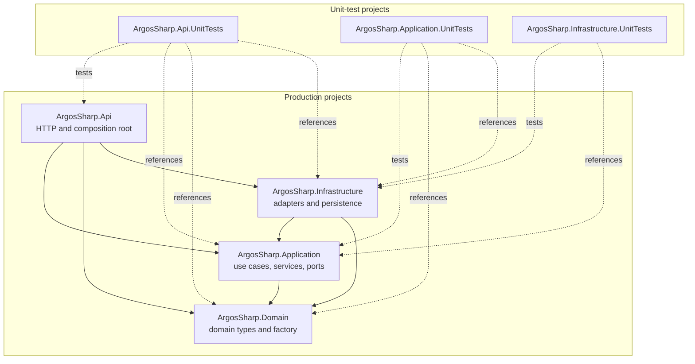
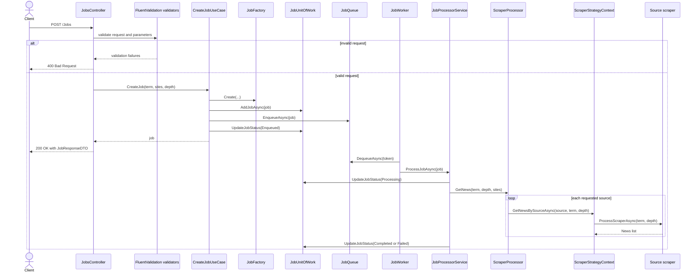
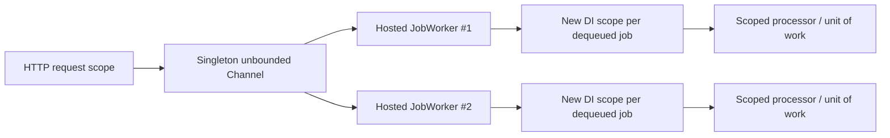
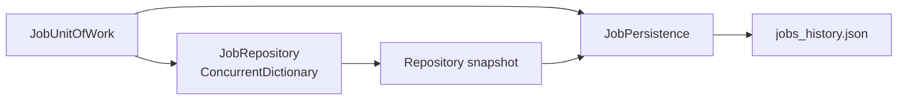
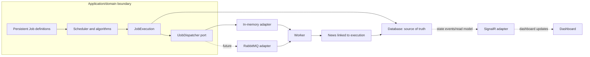

# ArgosSharp Architecture

## Document status

- Snapshot: current working tree inspected on 2026-08-14.
- Baseline commit visible during inspection: `d718869` (`WI refactoring`).
- Working tree: contains pre-existing, uncommitted production and test changes,
  especially an incomplete migration from `Domain.Model.Job` to
  `Domain.Entity.Job`.
- Validation: `dotnet test ArgosSharp.slnx --no-restore --nologo` did not reach
  test execution because `ArgosSharp.Domain` failed to compile.

This document uses:

- **FACT** — confirmed by code, configuration, tests, diagram, or build output.
- **DECISION** — explicitly recorded by the developer or accepted documentation.
- **INFERENCE** — likely interpretation, not a confirmed decision.
- **UNKNOWN** — insufficient evidence.

## Current Architecture

### Overview

**FACT:** ArgosSharp is an ASP.NET Core solution targeting .NET 8. It accepts a
job request, intends to persist and enqueue the job, and uses background workers
to collect municipal news through source-specific web scrapers.

**FACT:** The current layout has layered/ports-and-adapters characteristics:
Domain is dependency-free, Application owns several interfaces, Infrastructure
supplies adapters, and API is the composition root. **DECISION:** the target style
is Clean Architecture, confirmed after the initial repository inspection. The
current boundary leaks mean conformance has not yet been established.

**FACT:** The current working tree is transitional and is not executable. The
architecture below distinguishes source-level structure and intended call flow
from runtime behavior that was actually validated.

### Projects and dependencies

| Project | Observed responsibility | Boundary notes |
|---|---|---|
| `ArgosSharp.Api` | **FACT:** ASP.NET Core host, `POST /Jobs`, request/response DTOs, FluentValidation validators, DI registration, startup initialization, and an unused custom middleware. | **FACT:** References all production projects and acts as the composition root. |
| `ArgosSharp.Application` | **FACT:** Create-job and scraping orchestration, in-process queue, background worker, job processor, strategy context, and interfaces for fetcher, parser, repository, persistence, unit of work, and scraper strategy. | **FACT:** Depends on Domain. It also owns framework/package dependencies discussed under boundary observations. |
| `ArgosSharp.Domain` | **FACT:** `Job`, `JobExecution`, enums, domain exceptions, a job factory, and classes under `ValueObjects`. | **FACT:** Has no project or package references. The job model is currently inconsistent with its consumers. |
| `ArgosSharp.Infrastructure` | **FACT:** HTTP fetching, AngleSharp parsing, news mapping, pagination extraction, municipal scraper strategies, in-memory repository, JSON file persistence, and a class named Unit of Work. | **FACT:** Depends on Application and Domain, implementing Application interfaces. |

### Main source-level flow

The following flow is **FACT** as an expression of the current source files, but
it is not a successfully validated runtime flow because the solution does not
currently compile.

**FACT:** `CreateJobUseCase` persists before enqueueing, then persists an
`Enqueued` status after enqueueing. There is no rollback/compensation in the code
when one of those steps fails.

**FACT:** `JobProcessorService` catches all exceptions from processing, stores the
exception message on the job, and attempts to persist a `Failed` status.

### HTTP boundary

**FACT:** `JobsController` is internal, is routed as `[controller]`, and exposes
one internal `POST` action. API tests can access internal members through
`InternalsVisibleTo`.

**FACT:** Validation is performed explicitly in the controller:

- search term is required and rejects null, empty, and whitespace;
- parameters are required;
- depth must be greater than zero;
- sites must be non-null, non-empty, and contain no blank value.

**FACT:** A valid result is mapped manually to `JobResponseDTO`. The DTO exposes
public fields rather than properties. `AutoMapper` is referenced by the API
project, but no AutoMapper use or profile was found; `Infrastructure/Mapper/JobMapper.cs`
is empty.

**FACT:** `ArgosSharp.Api.http` and launch profiles still target a generated
`weatherforecast` route that is not implemented by the current API.

**FACT:** `MainMiddleware` is registered but never added to the HTTP pipeline.
If invoked, it catches every exception, logs without the exception object, and
does not define an error response. No public error contract is documented.

### Background processing and concurrency

**FACT:** `JobQueue` is a singleton wrapping an unbounded in-memory
`Channel<Job>`. The queue has no persisted backlog, capacity/backpressure,
completion operation, explicit ordering policy beyond channel defaults, or job
priority handling.

**FACT:** The API registers `JobWorker` twice as a hosted service. A source comment
says this is an experiment to understand whether two workers start; no accepted
decision or concurrency requirement was found.

**FACT:** Each worker creates a DI scope per dequeued job and resolves
`IJobProcessorService`. That service is not registered by the current composition
root, so this resolution would fail if startup and compilation reached that path.

### Persistence and state

**FACT:** `JobRepository` stores jobs in a `ConcurrentDictionary<Guid, Job>`,
assigns incremental integer IDs, and indexes records by `Job.JobHash`.

**FACT:** `JobPersistence` serializes repository snapshots to a temporary JSON
file and replaces `jobs_history.json`. Its `SemaphoreSlim` lock is instance-local.
No database, distributed cache, or external message broker was found.

**FACT:** API DI registers repository, persistence, factory, and unit of work as
scoped services. Consequently, separate HTTP/worker scopes receive separate
repository and persistence instances; the instance-local persistence locks do
not coordinate across scopes.

**FACT:** Startup attempts to resolve concrete `JobUnitOfWork`, although only
`IJobUnitOfWork -> JobUnitOfWork` is registered. `JobPersistence` also requires an
unregistered constructor `string`. These are composition-root inconsistencies,
not documented design decisions.

**INFERENCE:** The class named `JobUnitOfWork` currently acts as a repository plus
snapshot-persistence coordinator. There is no transactional resource or commit
boundary showing classic Unit of Work semantics.

### External integrations

| Integration | Evidence | Current wiring |
|---|---|---|
| Caraguatatuba municipal site | **FACT:** `CaraguatatubaScraper` uses HTTP, selectors, pagination, and `NewsMapper`. | **FACT:** Registered as the only `IScraperStrategy`. |
| Ubatuba municipal site | **FACT:** `UbatubaScraper` implementation and unit tests exist. | **FACT:** Not registered in API DI. |
| São Sebastião municipal site | **FACT:** `SaoSebastiaoScraper` implementation and unit tests exist. | **FACT:** Not registered in API DI. |

**FACT:** `IHttpFetcher` is implemented with `HttpClient`. `IHtmlParser` is
implemented with AngleSharp. External calls have no explicit timeout, retry,
circuit breaker, rate limit, or cancellation token in the application contract.

**FACT:** Strategy names are mutable strings (`caraguatatuba`, `ubatuba`, and
`sao_sebastiao`) and lookup is dictionary-based and case-sensitive. The
`ScraperSourceEnum` is not used by the current strategy contract.

### Stack and tools

| Area | Observed technology |
|---|---|
| Runtime | **FACT:** .NET projects target `net8.0`; no `global.json` pins the SDK. Validation selected installed SDK 10.0.302. |
| Web | **FACT:** ASP.NET Core Web SDK, controllers, built-in DI and hosted services. |
| Validation/mapping | **FACT:** FluentValidation 12.1.1 is used. AutoMapper 16.1.1 is referenced but no usage was found. |
| HTML/HTTP | **FACT:** `HttpClient`, AngleSharp 1.4.0, and AngleSharp.XPath 2.0.6. XPath usage was not found. |
| Logging | **FACT:** `Microsoft.Extensions.Logging` abstractions and package 10.0.8 in Infrastructure. |
| Tests | **FACT:** NUnit, Moq, FluentAssertions, Coverlet; package major versions differ between test projects. |
| Documentation/quality | **FACT:** DocFX 2.78.5 and Stryker 4.16.0 are local tools. No CI files are present in the current tree. |

**FACT:** The validation emitted a known moderate-severity vulnerability warning
for AngleSharp 1.4.0 (`GHSA-pgww-w46g-26qg`). No dependency-remediation policy is
documented.

### Tests

**FACT:** Tests are organized by layer:

- API unit tests cover request validators and `JobsController` behavior;
- Application unit tests cover create-job orchestration, queueing, worker
  delegation, job processing, strategy selection, and scraper aggregation;
- Infrastructure unit tests cover the HTTP fetcher, HTML parser, and three source
  scraper implementations using mocked fetcher/parser dependencies.

**FACT:** No tests were found for Domain types/factory in a dedicated project,
repository behavior, JSON persistence, unit-of-work coordination, startup/DI,
middleware behavior, integrations using real HTML, or end-to-end job processing.

**FACT:** Some tests and XML comments expect exception types or behaviors that do
not match the current implementation. Tests could not be executed because the
Domain project failed compilation first.

### Patterns observed

These are implementation observations, not proof that each pattern is an
accepted architectural decision:

- **FACT — Dependency Injection:** API registers interfaces and implementations.
- **FACT — Ports/adapters:** Application interfaces abstract fetching, parsing,
  persistence, repositories, unit of work, and scraper strategies; Infrastructure
  implements them.
- **FACT — Strategy:** multiple `IScraperStrategy` implementations are selected
  by `ScraperStrategyContext` using a string name.
- **FACT — Factory:** `JobFactory` validates input before constructing a job,
  although it currently calls an obsolete constructor shape.
- **FACT — Repository:** `JobRepository` abstracts in-memory job access.
- **FACT — Producer/consumer:** HTTP requests enqueue jobs into a channel and
  hosted workers dequeue them.
- **FACT — Mapper:** `NewsMapper` turns parsed fields into `News`; `JobMapper` is
  currently empty.
- **INFERENCE — Unit of Work:** the named class coordinates repository changes and
  persistence, but no atomic transaction is evident.

## Current inconsistencies and risks

The table records evidence; it does not prescribe fixes.

| Severity for current operability | Evidence-backed observation |
|---|---|
| Blocking | **FACT:** `JobFactory` calls the previous `Job(searchTerm, parameters, status)` shape, while the current entity declares `Job(name, searchTerm, parameters)`. Compilation fails with two `CS1503` errors. |
| Blocking after constructor migration | **FACT:** controllers, repositories, the processor, unit of work, and tests reference `Job.Status`, `Data`, `Error`, and `JobHash`, none of which exist on the current `Domain.Entity.Job`. Some tests also lack a using for the new namespace. |
| Startup | **FACT:** concrete `JobUnitOfWork` is resolved but not registered; `JobPersistence` requires an unregistered string; processor/context/scraper-processor services are not registered. |
| State consistency | **FACT:** repositories and persistence locks are scoped while the queue and workers span scopes, so in-memory snapshots and write locks are not shared globally. |
| Supported sources | **FACT:** three scrapers exist but only one is registered; request validation accepts arbitrary nonblank source strings. |
| Parsing | **FACT:** production selectors include `::text()` and `::attr(href)` strings, while the parser calls AngleSharp CSS `QuerySelector`/`QuerySelectorAll`; no real-parser test covers those scraper selectors. Whether the selector syntax works as intended is **UNKNOWN** and requires investigation. |
| Mapping pipeline | **FACT:** `AngleSharpHtmlParser.QueryTexts` returns each selected node's plain `TextContent`; scrapers then pass those strings to `NewsMapper` as if they were HTML and query them again for title/link/date selectors. Unit tests mock both stages rather than exercising this composition. The resulting production fields require an integration-level investigation. |
| Error behavior | **FACT:** processing catches all exceptions into job state; HTTP middleware, if enabled, would swallow exceptions without an explicit response. The public error contract is **UNKNOWN**. |
| Dependency security | **FACT:** build validation reports a moderate advisory for AngleSharp 1.4.0. |
| Documentation | **FACT:** `README.md` and the AI-first documentation baseline now exist; DocFX landing content is still placeholder; `ArgosSharp.slnx` references missing `TestReport.ps1`. |
| Diagrams | **FACT:** current `ArgosSharp.drawio` describes the create-job/worker call flow; `ArgosSharp.drawio.png` shows an older diagram with `JobController`, `JobMapper`, and `InMemoryJobStore`. The export is stale relative to the editable source. |

## Planned Architecture

The following target was explicitly provided by the developer on 2026-08-14. It
is **DECISION**, but remains planned architecture until implemented and validated.

**DECISION:** ArgosSharp adopts Clean Architecture and keeps the domain independent
of RabbitMQ, SignalR, databases, and other infrastructure technologies.

**DECISION:** `Job` is a long-lived, editable scraper definition. Each run is a
separate `JobExecution`; one job can have many executions, and one execution can
produce many `News` records.

**DECISION:** Scheduling algorithms belong to a scheduler that decides what and
when to execute, priority, retries, and concurrency without knowing RabbitMQ.
Dispatch occurs through a port. RabbitMQ, an in-memory dispatcher, and possible
future transports are replaceable adapters.

**DECISION:** RabbitMQ messages carry only an execution identifier; workers load
the execution and corresponding job. SignalR updates the dashboard but is never
the source of truth. The database is the intended source of truth, although its
technology and persistence contracts remain **UNKNOWN**.

**DECISION:** The intended delivery order is domain separation first, then
scheduler, in-memory dispatch, priority queue, binary heap, aging, per-domain
concurrency, retry/backoff/jitter, RabbitMQ, and finally SignalR.

The first specification is
[`001-job-execution-separation`](../../specs/features/001-job-execution-separation/spec.md).
Exact identifiers, JSON migration, repository lifetime, complete HTTP contract,
and some lifecycle semantics remain open and must not be inferred.

## ADR candidates awaiting developer confirmation

No ADR was created during this analysis. Some direction is now confirmed, but the
following topics still need enough detail and trade-off discussion before an ADR
is written:

The prioritized questionnaire is maintained in
[`open-questions.md`](open-questions.md).

1. Record `Job` versus `JobExecution` after identity, aggregate boundary,
   lifecycle details, and compatibility with existing persistence are resolved.
2. Choose the queue/worker model: number of consumers, backpressure, durability,
   shutdown/cancellation, priority, retries, and failure recovery.
3. Define persistence consistency and service lifetime: repository ownership,
   snapshot serialization, concurrent writers, and whether JSON remains the
   intended store.
4. Define supported scraper identifiers and registration/discovery behavior,
   including case sensitivity and invalid sources.
5. Confirm the intended module boundaries and ownership of AngleSharp, hosting,
   logging, mapping, and external adapter dependencies.
6. Define the public API and error contract, including status codes, asynchronous
   job response semantics, authentication, and authorization.

Ask the developer to confirm the completed context/alternatives before creating
any ADR file.
