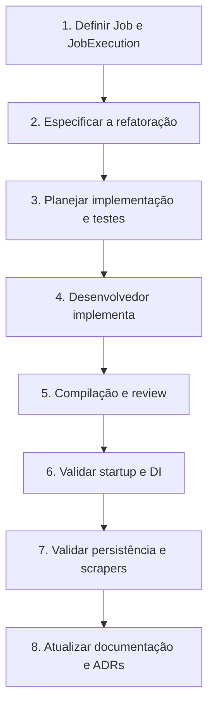

# Perguntas abertas e confirmações necessárias

## Objetivo

Este documento transforma as divergências e incertezas encontradas em perguntas
que podem ser respondidas pelo desenvolvedor e pelo mentor. Ele não prescreve
implementação.

Referências:

- [arquitetura atual](architecture.md);
- [modelo de domínio observado](../domain/domain-model.md);
- [constituição do projeto](../../specs/constitution.md);
- [feature spec da separação Job/JobExecution](../../specs/features/001-job-execution-separation/spec.md).

## Como usar

Para cada pergunta relevante, registre:

```text
Resposta:
Decisão confirmada por:
Data:
Impacto esperado:
Precisa de ADR? Sim / Não / A discutir
```

Uma resposta somente se torna **DECISION** quando for confirmada pelo
desenvolvedor. Até lá, ela permanece **UNKNOWN** ou **INFERENCE**.

## Respostas recebidas em 2026-08-14

O contexto de refatoração fornecido pelo desenvolvedor foi aceito como fonte de
**DECISION** para a arquitetura planejada.

| Tema | Estado | Resultado |
|---|---|---|
| Papel de `Job` | Confirmado | Definição permanente, editável e reutilizável de um scraper. |
| Papel de `JobExecution` | Confirmado | Uma execução completa e identificável de um job. |
| Cardinalidade | Confirmado | Um job possui muitas execuções; uma execução produz muitas notícias. |
| Estado e resultados | Confirmado | Status, erro, worker, tentativas, tempos e `News` pertencem à execução. |
| Retries/reexecução | Confirmado em alto nível | Retry automático mantém a execução e incrementa `Attempt`; reexecução manual/agendada cria outra execução. |
| Identificadores públicos | Em aberto | `Job.Id` e `JobExecution.Id` têm papéis distintos; destino de `JobHash` não decidido. |
| `Name`, `Enabled`, `Priority` | Parcial | Pertencem ao job; origem, invariantes e semântica detalhada ainda faltam. |
| Estados | Parcial | `Pending`, `Queued`, `Running`, `Completed` e `Failed`; `Cancelled` ainda é candidato. |
| Persistência antiga | Em aberto | Preferência por compatibilidade quando possível, sem decisão de migração. |
| Fontes | Parcial | Fontes atuais permanecem e novas devem ser adicionáveis sem alterar o domínio. |
| Contrato assíncrono | Parcial | API cria uma execução, solicita dispatch e retorna imediatamente; status HTTP, payload e consulta faltam. |
| Durabilidade | Direção confirmada | A fila final não pode perder jobs; RabbitMQ deverá persistir mensagens. A fase in-memory ainda precisa de regra. |
| Workers | Confirmado em alto nível | Múltiplos workers concorrentes são intencionais. |
| Repository/lifetime | Em aberto | Clean Architecture confirmada; ownership e lifetime ainda não. |
| Seletores | Parcial | Devem ser abstraídos para permitir CSS/XPath/outras estratégias; o contrato exato permanece aberto. |

Também estão confirmados Clean Architecture, domínio independente de tecnologia,
dispatcher como port, RabbitMQ/SignalR como adapters, banco como fonte de verdade
e algoritmos dentro do scheduler.

## Visão rápida



O núcleo do item 1 está confirmado. Identificadores, aggregate boundaries e
compatibilidade ainda bloqueiam a aprovação do plano técnico; os demais itens não
devem ser usados para adivinhar essas escolhas.

## 1. Job e JobExecution — núcleo confirmado

**Situação:** **FACT:** o novo `Job` não possui `Status`, `Data`, `Error` ou
`JobHash`; `JobExecution` possui parte dos dados de execução, mas ainda não é
usado. Factory, serviços, controller, persistência e testes continuam esperando o
modelo anterior.

### Decisões confirmadas

- `Job` é uma definição permanente e reutilizável, não uma execução.
- `JobExecution` é um ciclo completo de execução e possui identidade própria.
- A relação é `Job 1:N JobExecution 1:N News`.
- Estado, erros, worker, tentativas, tempos e resultados pertencem à execução.
- Retry automático mantém a mesma execução e incrementa `Attempt`.
- Reexecução manual ou agendada cria outra execução.
- `Job` contém configuração, nome, prioridade e estado de habilitado e não muda
  simplesmente porque uma execução ocorreu.
- As transições serão controladas pelo domínio.

### Perguntas ainda bloqueantes para o plano técnico

1. Quais são os tipos de `Job.Id` e `JobExecution.Id`, e quais deles aparecem no
   contrato público?
2. `JobHash` desaparece ou receberá uma responsabilidade diferente?
3. `Job` e `JobExecution` são aggregates separados ligados somente por ID, ou uma
   execução faz parte do aggregate de `Job`?
4. `News` faz parte do aggregate de execução ou é persistida separadamente com
   `ExecutionId`?
5. `Name` é obrigatório? É informado pelo cliente, gerado ou derivado?
6. `Enabled = false` bloqueia apenas novas execuções? O que ocorre com execuções
   já pendentes ou em andamento?
7. Como `Priority` interfere na ordenação e quais são os critérios de desempate?
8. `Cancelled` entra nesta primeira versão? De quais estados o cancelamento é
   permitido?
9. Qual é o limite de tentativas e o significado de falha terminal?
10. Datas devem usar UTC? Quem atualiza `UpdatedAt`?
11. A persistência anterior precisa ser migrada ou pode ser descartada?

### Confirmação necessária para avançar

- [x] Papel de `Job` confirmado.
- [x] Papel de `JobExecution` confirmado.
- [ ] Tipos e exposição pública dos identificadores confirmados.
- [ ] Aggregate boundaries e representação dos relacionamentos confirmados.
- [x] Responsabilidade por status, erro e resultados confirmada.
- [x] Semântica retry versus reexecução confirmada.
- [ ] Lifecycle completo, cancelamento e falha terminal confirmados.
- [ ] Compatibilidade de persistência confirmada.

A primeira feature spec pode ser escrita com essas lacunas explícitas, mas o
plano técnico não deve ser aprovado antes de resolvê-las.

## 2. Criação e validação de jobs

**Situação:** **FACT:** API, factory e scraper processor validam os mesmos valores
de maneiras diferentes.

1. Qual camada é a fonte autoritativa das invariantes: Domain, Application ou
   somente a borda HTTP?
2. Termo composto apenas por espaços é sempre inválido?
3. `Depth = 0` é inválido em todos os fluxos?
4. Existe profundidade máxima para proteger as fontes externas e o sistema?
5. Uma lista vazia de sites deve ser rejeitada ou representa “nenhuma fonte”?
6. Sites duplicados devem ser rejeitados, normalizados ou processados mais de uma
   vez?
7. A ordem dos sites tem significado?
8. Quais fontes são aceitas oficialmente e como essa lista chega ao cliente?
9. Uma fonte inválida deve produzir `400 Bad Request`, uma execução `Failed` ou
   outro comportamento?
10. Os identificadores de fonte são case-sensitive?
11. `ScraperSourceEnum` deve substituir strings, coexistir com elas ou ser
    removido?
12. As exceptions de domínio atuais fazem parte de algum contrato ou podem ser
    redefinidas pela spec?

## 3. API e contrato assíncrono

**Situação:** **FACT:** o código expressa `POST /Jobs` retornando `200 OK` com
dados do job, mas não há spec do contrato e o processamento ocorre em background.

**DECISION:** o contrato planejado cria uma `JobExecution`, solicita dispatch e
retorna imediatamente. Status HTTP, payload, consulta e erros permanecem abertos.

1. Criar um job deve retornar `200 OK`, `201 Created` ou `202 Accepted`?
2. Qual payload mínimo deve ser retornado imediatamente?
3. Deve existir uma URL para consultar status, execução, resultado e erro?
4. O cliente consulta `Job` ou uma `JobExecution` específica?
5. Quais erros devem ser públicos e em qual formato?
6. Erros internos do scraper podem ser expostos ao cliente ou precisam ser
   traduzidos/sanitizados?
7. A API precisa de autenticação ou autorização nesta fase da mentoria?
8. Há requisitos de idempotência para requisições repetidas?
9. Existe limite de tamanho para termo, lista de fontes ou resposta?
10. O endpoint e os DTOs devem ser públicos mesmo que as classes C# permaneçam
    internas?

## 4. Fila, workers e concorrência

**Situação:** **FACT:** há um `Channel<Job>` singleton e dois registrations de
`JobWorker`; o channel é ilimitado e não persistente.

**DECISION:** múltiplos workers concorrentes são intencionais e a arquitetura
final não pode perder jobs após restart. RabbitMQ é o adapter de durabilidade
planejado, mas algoritmos e `InMemoryDispatcher` serão desenvolvidos antes dele.

1. Dois workers são uma decisão ou apenas um experimento temporário?
2. A quantidade de workers precisa ser configurável?
3. A fila pode perder itens quando o processo reinicia?
4. Jobs persistidos como `Enqueued` devem ser recolocados na fila no startup?
5. É necessário limite de capacidade/backpressure?
6. A ordem precisa ser FIFO ou considerar `Priority` e horário?
7. Uma mesma definição de job pode executar simultaneamente?
8. Como cancelamento e shutdown devem tratar jobs em andamento?
9. Há timeout por execução ou por fonte externa?
10. Retries pertencem ao worker, ao processor, ao scraper ou a uma política
    externa?
11. Como evitar execução duplicada após falha parcial entre persistência e fila?
12. O sistema continuará sendo single-process ou precisa considerar múltiplas
    instâncias futuramente?

## 5. Persistência e lifetime

**Situação:** **FACT:** repository e persistence são scoped, enquanto fila e
workers atravessam scopes. Cada instância de persistence possui seu próprio lock.

**DECISION:** repositórios devem permanecer desacoplados da infraestrutura e o
banco será a fonte de verdade na arquitetura alvo. Tecnologia, contracts,
lifetimes e migração ainda não foram definidos.

1. Todos os requests e workers devem compartilhar o mesmo catálogo em memória?
2. JSON é a persistência pretendida para esta fase ou apenas um exercício?
3. O arquivo deve guardar definições, execuções, resultados ou todos eles?
4. Qual é a garantia esperada em escrita concorrente?
5. O caminho do arquivo vem de configuração, ambiente ou composição explícita?
6. O que fazer quando o arquivo estiver ausente, inválido ou parcialmente
   gravado?
7. Há necessidade de ordenação ou versionamento do schema JSON?
8. Mudanças no modelo exigem migração de dados?
9. A classe chamada `JobUnitOfWork` representa uma transação ou apenas coordena
   repository e persistence?
10. Qual deve ser o comportamento se persistir funcionar e enfileirar falhar, ou
    vice-versa?

## 6. Composition root e startup

**Situação:** **FACT:** o startup resolve um concrete type não registrado,
`JobPersistence` exige uma string não registrada e os serviços de processamento
não estão todos registrados.

1. A inicialização deve depender de `IJobUnitOfWork` ou do concrete type?
2. Como o caminho da persistência deve entrar no sistema?
3. Quais serviços são application services obrigatórios no startup?
4. Todos os três scrapers devem ser registrados agora?
5. O middleware customizado deve fazer parte do pipeline ou pode ser removido em
   uma tarefa futura?
6. Deve existir um teste que sobe o host e valida o grafo de DI?
7. Uma falha ao carregar o histórico deve impedir a API de iniciar?

Essas perguntas podem virar tarefas técnicas após o modelo de domínio e o
contrato de runtime serem confirmados; elas não exigem necessariamente ADR.

## 7. Parser, mapper e integrações externas

**Situação:** **FACT:** o parser devolve `TextContent`, enquanto os scrapers passam
esses valores ao mapper como HTML. Os selectors também usam construções como
`::text()` e `::attr(href)` sobre `QuerySelector`.

**DECISION:** o design alvo deve permitir CSS, XPath ou outras estratégias por
abstrações. Isso não confirma que os selectors ou o parser atuais estejam
corretos.

1. Os selectors pretendidos são CSS, XPath ou uma sintaxe própria?
2. O parser deve devolver texto, HTML do elemento ou um objeto/elemento
   navegável?
3. Quem deve ser responsável por extrair atributos como `href`?
4. Os links relativos devem ser convertidos em URLs absolutas?
5. Qual comportamento é esperado para data inválida ou ausente?
6. Os fallbacks `No title` e `No link` são regra aceita ou ocultam erro de parsing?
7. Notícias sem título/link devem ser descartadas, mantidas ou gerar falha?
8. É necessário deduplicar notícias entre páginas ou fontes?
9. Os três sites ainda possuem o HTML compatível com os selectors atuais?
10. Podemos manter fixtures de HTML representativas para testar parser, mapper e
    scraper juntos sem depender da internet?
11. Há restrições de rate limit, robots, timeout ou identificação do cliente HTTP
    que precisam ser respeitadas?

## 8. Testes e qualidade

1. Quais níveis são obrigatórios: unitário, integração, host/API e end-to-end?
2. Qual é o objetivo de coverage e mutation score, se houver?
3. Domain deve ganhar um projeto próprio de testes?
4. Repository, persistence e concorrência precisam de testes específicos?
5. O pipeline parser/mapper/scraper deve possuir testes de integração com HTML
   realista?
6. O startup deve ter um smoke test que detecte DI inválida?
7. As versões de NUnit, test SDK e Coverlet devem ser uniformizadas?
8. O SDK .NET deve ser fixado com `global.json`?
9. Qual política deve tratar warnings de nulabilidade?
10. Qual é a prioridade para avaliar o advisory de `AngleSharp 1.4.0`?
11. Haverá CI? Quais comandos e gates devem ser obrigatórios?

## 9. Documentação e produto

1. Quem é o usuário/ator principal do ArgosSharp?
2. Qual problema real o projeto pretende resolver nesta etapa da mentoria?
3. O sistema é uma API educacional, um serviço utilizável ou ambos?
4. Quais cenários estão explicitamente fora de escopo?
5. O português ou o inglês será o idioma padrão da documentação e dos contratos?
6. O diagrama Draw.io será mantido junto com Mermaid ou pode ser considerado
   material histórico?
7. A imagem `ArgosSharp.drawio.png` deve ser reexportada após o fluxo ser
   confirmado?
8. O DocFX continuará como ferramenta oficial de publicação?

## 10. ADRs aguardando confirmação

Nenhum ADR foi criado. Algumas direções abaixo já são decisões, mas o ADR só deve
ser escrito depois de completar contexto, alternativas e consequências.

| Candidato | Pergunta central | Estado |
|---|---|---|
| Job versus JobExecution | Como definição, execução, tentativa, resultado e identidade se relacionam? | Núcleo confirmado; IDs, aggregates, cancelamento e migração pendentes. |
| Queue e workers | Qual garantia de ordem, concorrência, durabilidade, retry e shutdown é necessária? | Concorrência/durabilidade alvo confirmadas; detalhes pendentes. |
| Persistência e lifetime | Qual store, consistência e ownership de estado o sistema adota? | Aguardando respostas da seção 5. |
| Fontes suportadas | Como fontes são identificadas, validadas, registradas e expostas? | Extensibilidade confirmada; vocabulary/validation pendentes. |
| Boundaries | Onde pertencem hosting, AngleSharp, logging, mapping e configuration? | Clean Architecture confirmada; ownership por camada pendente. |
| Contrato HTTP e segurança | Qual é a semântica assíncrona, o formato de erros e a necessidade de auth? | Retorno imediato confirmado; contrato detalhado pendente. |

## 11. Roteiro de decisão

### Agora — necessário para destravar

- [x] Confirmar o núcleo da seção 1.
- [x] Registrar o requisito que motivou a refatoração.
- [ ] Responder às perguntas ainda bloqueantes da seção 1.
- [ ] Confirmar se há compatibilidade obrigatória com o modelo/persistência
  anterior.
- [x] Criar a spec, plano, tarefas e cenários de aceitação em draft.
- [ ] Revisar e aprovar a spec da refatoração.

### Depois da spec — planejamento

- [ ] Responder às questões de validação e contrato HTTP afetadas.
- [ ] Definir plano de persistência e processamento.
- [ ] Identificar quais escolhas precisam de ADR.
- [x] Produzir tarefas pequenas e cenários de aceitação em draft para o
  desenvolvedor.
- [ ] Aprovar tarefas e cenários após fechar as decisões.

### Depois da implementação manual — verificação

- [ ] Solicitar code review por severidade.
- [ ] Compilar e executar os testes.
- [ ] Validar startup/DI.
- [ ] Testar a composição parser/mapper/scraper.
- [ ] Atualizar arquitetura, domínio, README e ADRs confirmados.

## Próxima conversa sugerida

Revise a feature spec e responda às cinco primeiras perguntas ainda abertas da
seção 1: tipos/exposição dos IDs, destino de `JobHash`, aggregate boundary de
Job/JobExecution, boundary de News e origem/invariantes de `Name`.
