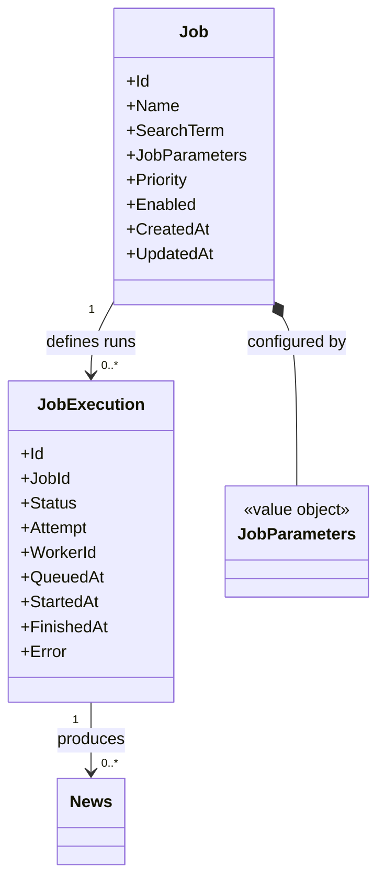
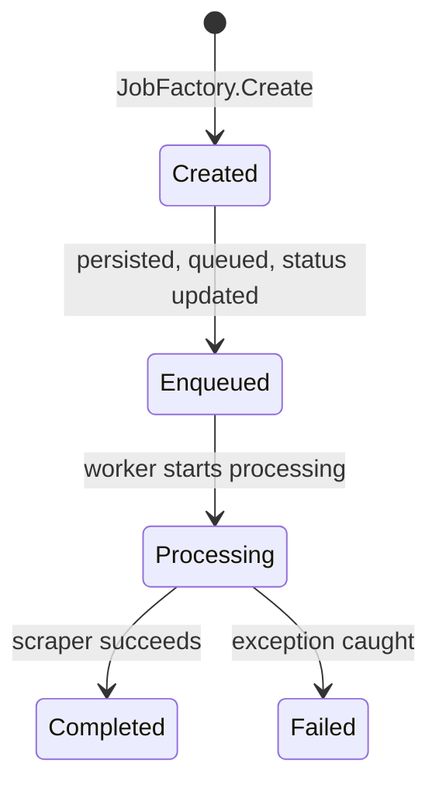
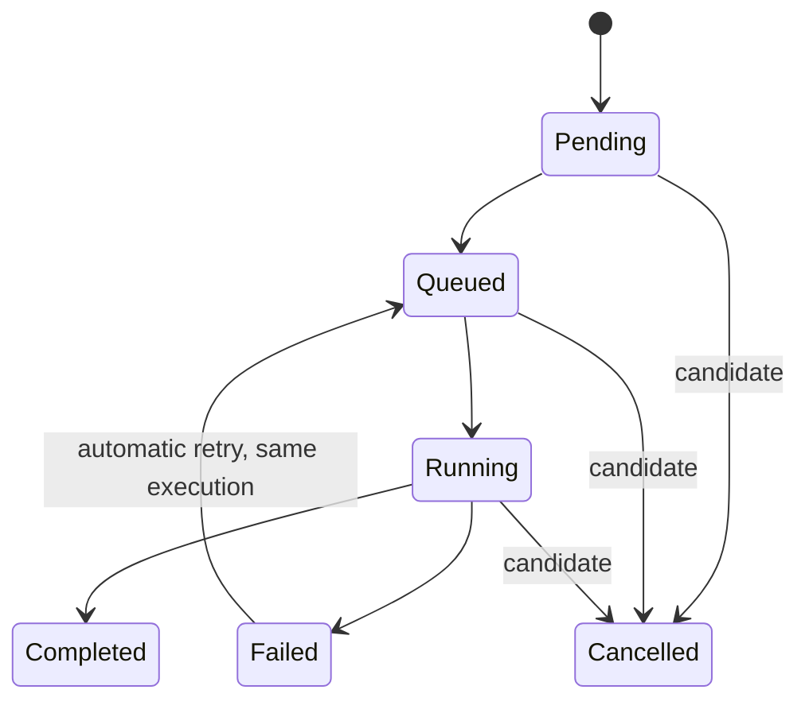
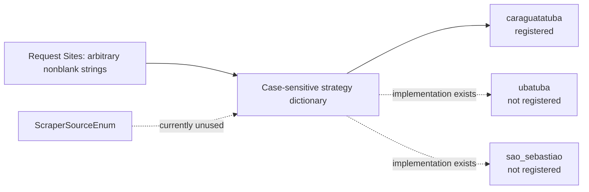

# ArgosSharp Domain Model

## Document status

This document separates the current working tree inspected on 2026-08-14 from the
planned domain model explicitly confirmed by the developer on the same date. A
planned decision is not presented as implemented behavior.

Evidence labels:

- **FACT** — directly confirmed by current code, tests, or validation.
- **DECISION** — explicitly recorded by the developer or accepted documentation.
- **INFERENCE** — probable interpretation based on evidence.
- **UNKNOWN** — insufficient evidence.

## Domain overview

**FACT:** The current code is concerned with creating jobs that search one or more
municipal news sources to a requested page depth. Scraped results are represented
as `News` values. A new `JobExecution` type models execution metadata separately
from the current `Job` type, but no current application service uses it.

**DECISION:** The refactoring separates the long-lived scraper definition (`Job`)
from each complete run (`JobExecution`). Execution status, errors, worker,
attempts, timings, and produced news belong to the execution, not to the job.

**FACT:** The model is currently inconsistent with the rest of the solution and
does not compile through `JobFactory`, so relationships shown below are structural
rather than validated runtime behavior.

## Current structural model

```mermaid
classDiagram
    class Job {
        +int JobId
        +string Name
        +string SearchTerm
        +JobParameters Parameters
        +JobPriority Priority
        +bool Enabled
        +DateTime CreatedAt
        +DateTime UpdatedAt
    }

    class JobExecution {
        +Guid Id
        +int JobId
        +JobStatusEnum JobStatus
        +int Attempt
        +string? WorkerId
        +DateTime QueuedAt
        +DateTime? StartedAt
        +DateTime? FinishedAt
        +string? Error
    }

    class JobParameters {
        +List~string~ Sites
        +int Depth
    }

    class JobPriority {
        <<enumeration>>
        Low
        Medium
        High
    }

    class JobStatusEnum {
        <<enumeration>>
        Created
        Enqueued
        Processing
        Completed
        Failed
    }

    class News {
        +string Title
        +DateTime? DateTime
        +int Year
        +string Link
        +string Abstract
        +string Source
    }

    class ScraperSelectors {
        +string Date
        +string Title
        +string Link
        +string Abstract
        +string Pagination
        +string News
    }

    Job *-- JobParameters : contains
    Job --> JobPriority : has
    JobExecution --> JobStatusEnum : has
    JobExecution ..> Job : "JobId only; not enforced"
```

`News` and `ScraperSelectors` have no object relationship to the current `Job` or
`JobExecution` classes. Existing application code still expects a collection of
results on `Job`, but that property is absent from the current entity.

## Planned domain model

The following model is **DECISION** supplied by the developer. It is not yet the
implemented model.



Confirmed rules:

- **DECISION:** `Job` is a permanent, editable definition of what a scraper must
  execute and can exist for months.
- **DECISION:** executing a job does not change its execution state because
  `Job` owns no execution status.
- **DECISION:** `JobExecution` represents one complete execution and has its own
  identity.
- **DECISION:** automatic retries remain within the same execution and increment
  `Attempt`; manual or scheduled re-execution creates another `JobExecution`.
- **DECISION:** `News` is related to the execution that produced it. The former
  untyped `IEnumerable<object> Data` must disappear.
- **DECISION:** `JobParameters` remains a value object. `RetryPolicy`,
  `WorkerIdentifier`, and `SearchTerm` are only possible future value objects,
  not current decisions.

Still open:

- **UNKNOWN:** public identifier types and the future or removal of `JobHash`;
- **UNKNOWN:** aggregate boundaries and how relationships are represented or
  persisted;
- **UNKNOWN:** exact input/source for `Name` and detailed behavior of `Enabled`;
- **UNKNOWN:** timestamp UTC policy and update rules;
- **UNKNOWN:** compatibility or migration for the old JSON representation.

## Elements and responsibilities

### Job

**FACT:** `Job` is a sealed class under `ArgosSharp.Domain.Entity` constructed
with `name`, `searchTerm`, and `JobParameters`. It assigns defaults:

- `JobId = 0`;
- `Priority = Low`;
- `Enabled = true`;
- `CreatedAt` and `UpdatedAt` use local `DateTime.Now`.

**FACT:** All properties except `CreatedAt` have public setters. The constructor
does not validate name, search term, or parameters, and no method protects state
transitions or timestamp consistency.

**UNKNOWN:** The business meaning and uniqueness of `Name`, whether `JobId` is the
identity, whether jobs are recurring/reusable, who may disable a job, and when
`UpdatedAt` must change are not documented.

**UNKNOWN:** No rule connects `Priority` to queue order. The current queue is FIFO
by channel behavior and never reads priority.

### JobExecution

**FACT:** `JobExecution` is a sealed mutable data class with execution ID, job ID,
status, attempt number, optional worker, queued/started/finished timestamps, and
optional error.

**FACT:** No constructor, validation, relationship, repository, persistence
mapping, use case, or test currently uses `JobExecution`.

**INFERENCE:** Its fields suggest per-attempt execution tracking. Allowed status
transitions, attempt numbering, timestamp ordering, worker ownership, retry rules,
and relationship cardinality are **UNKNOWN**.

### JobParameters

**FACT:** `JobParameters` contains a mutable `List<string> Sites` and mutable
`int Depth`. The class is under `ValueObjects`, but does not implement value
equality or immutability.

**INFERENCE:** `Depth` means the maximum number of search-result pages considered
per source; scraper code includes the first page and requests pages 2 through the
smaller of detected maximum and depth.

**UNKNOWN:** Duplicate sources, source ordering, maximum depth, later mutation,
and source normalization have no documented domain rule.

### News

**FACT:** `News` contains title, nullable date, year, link, abstract, and source.
Properties have private setters. A null/blank abstract becomes an empty string;
other inputs are accepted without validation.

**INFERENCE:** `News` represents a scraper output snapshot rather than an entity:
no identifier or lifecycle behavior is present. The repository does not document
whether duplicate results across pages/sources are allowed.

**UNKNOWN:** Required fields, URL validity, date/year consistency, deduplication,
text normalization, and equality semantics are not defined.

### ScraperSelectors

**FACT:** `ScraperSelectors` is an initializer-based configuration holder under
the Domain project and `ValueObjects` namespace. Its properties are `init`-only,
and Infrastructure scrapers instantiate it with source-specific selectors.

**INFERENCE:** It is adapter configuration rather than a domain concept. Its
placement may be a boundary concern, but no accepted architecture rule confirms
the intended owner.

**FACT:** Its non-nullable properties are not initialized by a constructor or
marked `required`; compilation emits nullable warnings for every selector
property.

### JobFactory and domain exceptions

**FACT:** `JobFactory.Create(searchTerm, sites, depth)` checks:

- `searchTerm` is not null or empty;
- `depth` is greater than zero;
- `sites.Count` is greater than zero.

It throws `InvalidSearchTermException`, `InvalidDepthException`, or
`InvalidSitesException` respectively.

**FACT:** The factory does not guard a null `sites` list or blank values inside
the list. It currently attempts to call a constructor shape that no longer
exists, which is the first confirmed compilation failure.

**INFERENCE:** The factory was the intended creation boundary for the previous
job model, but the current entity migration has not established a valid creation
contract.

### Status and source enums

**FACT:** `JobStatusEnum` defines `Created`, `Enqueued`, `Processing`, `Completed`,
and `Failed`.

**FACT:** The current `Job` has no status; `JobExecution` has the enum-valued
status. Existing services still read/write `Job.Status`.

**FACT:** `ScraperSourceEnum` declares `Caraguatatuba`, `Ubatuba`, `SaoSebastiao`,
and two test-only values. Production selection does not use this enum; it uses
case-sensitive strings from mutable strategy names.

**UNKNOWN:** The enum is either obsolete or intended for a future typed source
contract. No evidence decides which.

## Observed validation rules and divergences

The same input is validated differently at three boundaries:

| Input | API validators | `JobFactory` | `ScraperProcessor` |
|---|---|---|---|
| Search term | **FACT:** rejects null, empty, and whitespace. | **FACT:** rejects null/empty; whitespace passes. | **FACT:** rejects null/empty; whitespace passes. |
| Parameters object | **FACT:** must be non-null. | **FACT:** receives separate values. | **FACT:** receives separate values. |
| Depth | **FACT:** must be `> 0`. | **FACT:** must be `> 0`. | **FACT:** rejects only negative values; zero passes. |
| Sites collection | **FACT:** non-null, non-empty, with no blank item. | **FACT:** empty rejected; null causes an unhandled dereference; blank items pass. | **FACT:** empty is accepted and returns no news; null behavior is not guarded. |

**FACT:** `IScraperProcessor` documentation says invalid inputs throw
`ArgumentNullException`, while implementation throws custom domain exceptions.
Current unit tests expect `ArgumentNullException`. This is a code/test/document
divergence, not an established domain rule.

**UNKNOWN:** Whether validation belongs at all three layers, and which layer is
authoritative, has not been decided.

## Observed lifecycle and current break

The application source still expresses this lifecycle:



**FACT:** This lifecycle is encoded by `CreateJobUseCase` and
`JobProcessorService`, and was modeled by the previous `Job` class.

**FACT:** It is not representable by the current `Job` entity because that type
has no `Status`, `Data`, `Error`, or `JobHash`. `JobExecution` has status/error
fields but is not connected to those services. Therefore the diagram is observed
application intent, not current executable domain behavior.

The planned execution lifecycle is now partially confirmed:



**DECISION:** transitions must be controlled by the domain instead of arbitrary
property mutation. `Pending`, `Queued`, `Running`, `Completed`, and `Failed` are
the initial states. `Cancelled` is a possible future state and therefore remains
**UNKNOWN** until confirmed.

**DECISION:** the scheduler decides retries. A retry increments `Attempt` on the
same execution, while manual/scheduled re-execution creates a new execution.
Retry limits, backoff, jitter, terminal failure semantics, and whether priority
affects a specific queue order remain **UNKNOWN**.

## External source vocabulary



**FACT:** Unsupported strings cause dictionary lookup failure during background
processing, which the processor converts to a failed job in the old lifecycle.
No API-level supported-source rule or public vocabulary is documented.

## Domain decisions and unknowns

**DECISION:** `Job` and `JobExecution` are entities; `JobParameters` is a value
object. The domain owns the execution state machine and remains independent of
RabbitMQ, SignalR, databases, and other infrastructure technologies.

**DECISION:** one job has many executions and each execution has many news
results. Job owns configuration, while execution owns volatile runtime state.

**UNKNOWN:** identifier/public-contract details, aggregate boundaries, storage
mapping, JSON compatibility, complete invariants, cancellation, retry policy
parameters, result deduplication, and the canonical supported-source vocabulary.

These remaining unknowns are tracked in
[`../architecture/open-questions.md`](../architecture/open-questions.md) and in
the draft feature specification.
