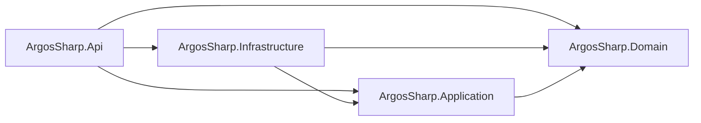

# ArgosSharp Constitution

## Purpose and authority

This constitution is the minimum reliable baseline for specification, review,
and architectural governance in ArgosSharp. It was initialized from the working
tree inspected on 2026-08-14. It does not turn observed implementation choices
into approved architecture without evidence.

Evidence labels used throughout this document:

- **FACT** — confirmed by the repository or a validation result.
- **DECISION** — explicitly requested by the developer or recorded in an
  accepted project document.
- **INFERENCE** — plausible, but not explicitly decided.
- **UNKNOWN** — insufficient evidence.

When an enduring rule cannot be inferred safely, it is marked `TO BE DEFINED`.

## 1. Development ownership

**DECISION:** The developer owns production implementation. AI agents default to
reviewer and specification-assistant mode and must not implement production code
unless explicitly asked for a defined scope.

**DECISION:** Reviews must expose correctness and design problems even when the
current happy path works. Agents must not automatically refactor or correct
findings because the implementation is part of a human mentorship assessment.

The operational rules are defined in [`AGENTS.md`](../AGENTS.md).

## 2. Architecture

**FACT:** The solution currently contains the following production project
dependency graph:

**FACT:** `ArgosSharp.Domain` has no project or package references.
`ArgosSharp.Application` declares contracts used by infrastructure adapters, and
the API project composes implementations through dependency injection.

**DECISION:** The target architecture is Clean Architecture. The domain remains
independent of RabbitMQ, SignalR, databases, web frameworks, and other concrete
infrastructure. Dispatch and similar external capabilities are exposed through
ports; concrete transports are replaceable adapters.

**FACT:** The current project structure resembles that target, but the documented
boundary leaks and incomplete composition mean the target is not yet fully
implemented.

**Constitutional rule:** Preserve the observed project dependency direction until
the developer approves a change through a reviewed plan and, when warranted, an
ADR. This protects the only architecture baseline supported by current evidence;
it does not assert that every namespace is correctly placed today.

**Constitutional rule:** Domain rules, entities, value objects, and scheduling
decisions must not depend on a concrete broker, real-time transport, database, or
adapter. Infrastructure must remain substitutable behind inward-facing contracts.

The detailed baseline and known boundary leaks are maintained in
[`docs/architecture/architecture.md`](../docs/architecture/architecture.md).

## 3. Simplicity and design

**FACT:** The code uses direct use-case/service classes, dependency injection,
interfaces at external boundaries, a factory, strategy selection, a channel-based
queue, repositories, and a class named Unit of Work.

**UNKNOWN:** There is no documented threshold for introducing an interface,
pattern, abstraction, or third-party dependency.

**Rule:** `TO BE DEFINED` — the project needs developer-confirmed simplicity and
design criteria. Until then, reviews may identify unnecessary complexity or
premature abstractions as questions, but must not present a preferred alternative
as an established project rule.

## 4. Code quality

**FACT:** All production projects target `net8.0`, enable nullable reference
types, and enable implicit global usings.

**FACT:** No repository-wide formatter, `.editorconfig`, compiler warning policy,
or `TreatWarningsAsErrors` rule was found.

**Rule:** New review findings must distinguish correctness failures from style
preferences. Quality gates beyond successful compilation and relevant tests are
`TO BE DEFINED`.

## 5. Testing

**FACT:** Unit tests are separated into API, Application, and Infrastructure test
projects. They use NUnit, Moq, FluentAssertions, and Coverlet. A Stryker tool and
configuration are present for mutation testing.

**FACT:** No Domain test project, integration test project, end-to-end test suite,
or documented coverage/mutation threshold was found.

**Rule:** Feature specifications must identify verifiable scenarios, and technical
plans must state the testing strategy before developer implementation.

**Rule:** `TO BE DEFINED` — required test levels, naming conventions, coverage
thresholds, mutation score, and CI gates have not been explicitly decided.

## 6. Dependencies

**FACT:** NuGet versions are pinned in individual project files, but test projects
use different major versions of NUnit, Coverlet, and `Microsoft.NET.Test.Sdk`.
There is no central package management file or `global.json`.

**FACT:** `AngleSharp` and ASP.NET Core hosting packages are declared by the
Application project even though the observed AngleSharp implementations are in
Infrastructure and background hosting is framework-specific.

**Rule:** A dependency change requires an explicit developer request or an
approved technical plan. Reviewers may identify ownership, version, transitive
dependency, or vulnerability concerns but must not update packages automatically.

**Rule:** `TO BE DEFINED` — approved versioning, vulnerability remediation, and
package placement policies are not documented.

## 7. Security and failure handling

**FACT:** The API redirects to HTTPS and calls authorization middleware, but no
authentication/authorization registration or endpoint policy was found.

**FACT:** The 2026-08-14 validation reported a known moderate-severity advisory
for `AngleSharp` 1.4.0 (`GHSA-pgww-w46g-26qg`).

**FACT:** A custom middleware exists and logs caught exceptions, but it is not in
the HTTP pipeline in `Program.cs`.

**Rule:** Security-relevant behavior and error contracts must be explicit in a
feature specification or architectural decision when applicable. Agents must
report security risks rather than silently changing packages or behavior.

**Rule:** `TO BE DEFINED` — authentication, authorization, secrets, dependency
remediation time, logging sensitivity, and external-request policies are not
established.

## 8. Specifications

**DECISION:** New features follow specification before implementation:

```mermaid
flowchart LR
    Requirement["Requirement"] --> Spec["spec.md"]
    Spec --> Review["Specification review"]
    Review --> Plan["plan.md"]
    Plan --> Tasks["tasks.md"]
    Tasks --> Developer["Developer implementation"]
    Developer --> Acceptance["acceptance.md verification"]
    Acceptance --> AIReview["AI review"]
    AIReview --> Mentor["Human mentor review"]
```

**DECISION:** A feature directory contains `spec.md`, `plan.md`, `tasks.md`, and
`acceptance.md`. The plan must be discussed with the developer before
implementation, and tasks are assigned to the developer, not automatically
executed by an AI agent.

**DECISION:** No feature spec may be created only to populate the directory.
Observed behavior, desired requirements, decisions, inferences, and unknowns must
remain distinguishable.

## 9. Documentation

**DECISION:** Documentation describes the real working tree. Planned architecture
must be separated from current architecture. A disagreement between code, tests,
diagrams, and prose is recorded rather than silently reconciled.

**DECISION:** Architecture and domain diagrams use Mermaid. Documentation must be
updated when the developer requests it or when documentation is part of the
explicit task; production code must not be changed merely to fit the document.

**FACT:** At constitution initialization, no `README.md` existed and the DocFX
landing page still contained generated placeholder text. These are documentation
gaps, not implicit requirements.

## 10. Architectural decisions

An ADR may be created only after the developer confirms the decision or when
clear historical evidence records an already accepted choice. Do not create
retroactive ADRs from architecture-shaped code alone.

Evaluate whether an ADR is warranted when a reviewed plan changes one or more of:

- project/module boundaries or dependency direction;
- job identity, lifecycle, scheduling, queueing, or concurrency model;
- persistence technology, consistency model, or repository lifetime;
- external scraper contracts or supported source identifiers;
- public HTTP contracts, error semantics, authentication, or authorization;
- cross-cutting framework and package ownership.

**Rule:** `TO BE DEFINED` — the developer has not yet confirmed a formal ADR
approval, supersession, or numbering process. Until then, use `Status`, `Context`,
`Decision`, `Alternatives`, and `Consequences`, and ask for confirmation before
creating an ADR.

## 11. Amendments

Changes to this constitution require an explicit developer decision, a reason,
and an update to affected architecture, domain, or agent guidance. An amendment
must not be inferred solely from newly written code.
